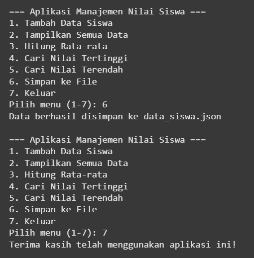

# aplikasi manajemen nilai siswa (CLI)
program sederhana berbasis CLI (command line interface) untuk mengelola data nilai siswa, dibuat menggunakan bahasa phyton sebagai bagian dari tugas algoritma dan pemrograman.
## fitur
- menambahkan data siswa (nama dan nilai)
- menampilkan semua data siswa
- menghitung rata-rata nilai siswa
- menampilkan nilai tertinggi
- menampilkan nilai terendah
- menyimpan data ke file 'data_siswa.json'
## teknologi
menggunakan bahasa phython, CLI (command line interface), JSON untuk penyimpanan data
## cara menjalankan program
1. jalankan file 'main.py' menggunakan phython
2. gunakan menu yang tersedia dengan memilih angka 1-7
3. data yang sudah dimasukkan bisa disimpan ke file 'data_siswa.json'
## struktur folder
main.py -----------> program utama

data_siswa.json ---> data siswa

assets ------------> folder untuk gambar/screenshot

README.md ---------> ringkasan singkat mengenai program ini

laporan_tugas -----> penjelasan dari semua pertanyaan yang ada pada soal
## preview CLI
contoh hasil tampilan CLI: 

## catatan tambahan
- file 'main.py' berisi logika program CLI. data yang di input pengguna akan disimpan sementara di memori, lalu dapat disimpan permanen ke dalam file 'data_siswa.json'
- program ini berjalan di lingkungan terminal/CLI seperti cmd, terminal linux, atau google colab (dengan input manual)
- file 'data_siswa.json' akan terupdate setiap kali menu simpan digunakan
---
## pembuat
nama: fio lola karmila
nim: 24110310027
kelas: 2a
tugas: algoritma dan dasar pemrograman
